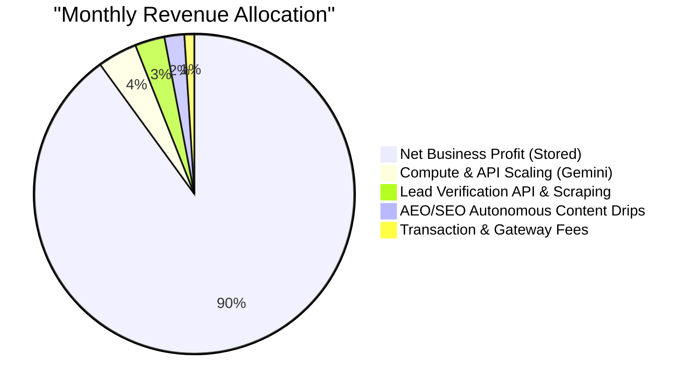

# Vext Audit Capital - Financial Targets & Reinvestment Roadmap

This document outlines the official revenue and net profit targets for Vext Audit Capital during the FY 2026-2027 period, details the underlying lead-to-conversion mathematical model, and structures the automated reinvestment program required to maintain our status as a 100% automated AI-based compliance firm.

---

## 📊 FY 2026-2027 OFFICIAL TARGETS (INR)

### 1. Monthly Revenue Projections
Our target timeline reflects an aggressive scale-up enabled by our lead-generation agents:

| Month | Target (Rs.) | Estimated Sales Required | Target Net Profit (90% Margin) |
| :--- | :--- | :--- | :--- |
| **May 2026** (Historical) | ₹2,00,000 | 5 | ₹1,80,000 |
| **June 2026** (Current) | ₹60,00,000 | 150 | ₹54,00,000 |
| **July 2026** | ₹1,00,00,000 | 250 | ₹90,00,000 |
| **August 2026** | ₹1,10,00,000 | 275 | ₹99,00,000 |
| **September 2026** | ₹1,21,00,000 | 302 | ₹1,08,90,000 |
| **October 2026** | ₹1,33,10,000 | 332 | ₹1,19,79,000 |
| **November 2026** | ₹1,46,41,000 | 366 | ₹1,31,76,900 |
| **December 2026** | ₹1,61,05,100 | 402 | ₹1,44,94,590 |
| **January 2027** | ₹1,77,15,610 | 442 | ₹1,59,44,049 |
| **February 2027** | ₹1,94,87,171 | 487 | ₹1,75,38,454 |
| **March 2027** | ₹2,14,35,888 | 535 | ₹1,92,92,299 |

### 2. Quarterly Revenue Projections
| Quarter | Months included | Target (Rs.) |
| :--- | :--- | :--- |
| **Q1 FY 26-27** | Apr - Jun 2026 | **₹62,00,000** |
| **Q2 FY 26-27** | Jul - Sep 2026 | **₹3,31,00,000** |
| **Q3 FY 26-27** | Oct - Dec 2026 | **₹4,40,56,100** |
| **Q4 FY 26-27** | Jan - Mar 2027 | **₹5,86,38,669** |

### 3. Half-Yearly Revenue Projections
- **H1 FY 26-27** (Apr - Sep 2026): **₹3,93,00,000**
- **H2 FY 26-27** (Oct - Mar 2027): **₹10,26,94,769**

### 4. Full Year FY 2026-2027 Core Metrics
- **Total FY Target**: **₹14,19,94,769** (~$1.71 Million USD)
- **Minimum FY Target**: **EUR 1,800,000 equivalent** (~₹16.20 Crore or $1.95 Million USD)
- **Target Net Profit (Blended 90% margin)**: **₹12,77,95,292** (due to zero employee headcount and low-cost serverless SaaS overheads)

---

## 🎯 LEAD CONVERSION MATH MODEL
The 6 deployed lead-generating agents combined generate **300 to 500 verified leads per day** targeting our corporate compliance Ideal Customer Profile (ICP).

- **Daily Lead Volume**: 300 to 500 leads (Avg: 400 leads/day)
- **Monthly Lead Volume**: 9,000 to 15,000 leads (Avg: 12,000 leads/month)
- **Blended Average Order Value (AOV)**: **₹40,000** (accounting for core Indian compliance packs and Global Intelligence services)

### Conversion Feasibility Index
To hit our target milestones using strictly organic, agent-driven outbound marketing (zero direct advertising spend):

- **June 2026 Target (₹60,00,000)**:
  - Requires **150 orders**.
  - Lead-to-sale conversion rate needed: **1.25%** (at 12,000 monthly leads).
- **July 2026 Target (₹1,00,00,000)**:
  - Requires **250 orders**.
  - Lead-to-sale conversion rate needed: **2.08%** (at 12,000 monthly leads).
- **Annual Target (₹14,19,94,769)**:
  - Requires **3,550 total orders**.
  - Out of **1,46,000 annual leads** generated by agents, the required conversion rate is **2.43%**.

This mathematically validates that our $0 marketing spend target is highly realistic with high-quality outbound lead verification and continuous nurturing.

---

## ⚙️ AUTOMATED ENHANCEMENTS & REINVESTMENT MATRIX
To maintain our competitive edge as a pioneer in **100% automated AI compliance**, we allocate a programmatic reinvestment tier from our monthly revenues:

### 1. Compute & API Scaling (4% Allocation)
- Automatically reinvested to power the **Gemini 3.5 Flash (High)** and **Gemini 1.5 Pro** endpoint operations.
- Scales agent capacity to process complex PDF statutory uploads and construct replies dynamically for the 5 mailboxes without delay.

### 2. Lead Verification & Enrichment (3% Allocation)
- Used to buy external validation API credits (reputation vetting, email deliverability, corporate credit lookups).
- Ensures that the 300–500 leads daily are verified before outreach, keeping bounce rates under 1%.

### 3. AEO/SEO Autonomous Content Drips (2% Allocation)
- Auto-routed to publishing networks for continuous Sitemap submission, Search Console API integrations, and email newsletter distribution.

### 4. Financial Routing & Flow
- Net incoming flows via Razorpay settlement accounts are programmatically distributed, keeping the primary treasury at 90% and operational API wallets auto-replenished at 10% on a rolling weekly basis.
